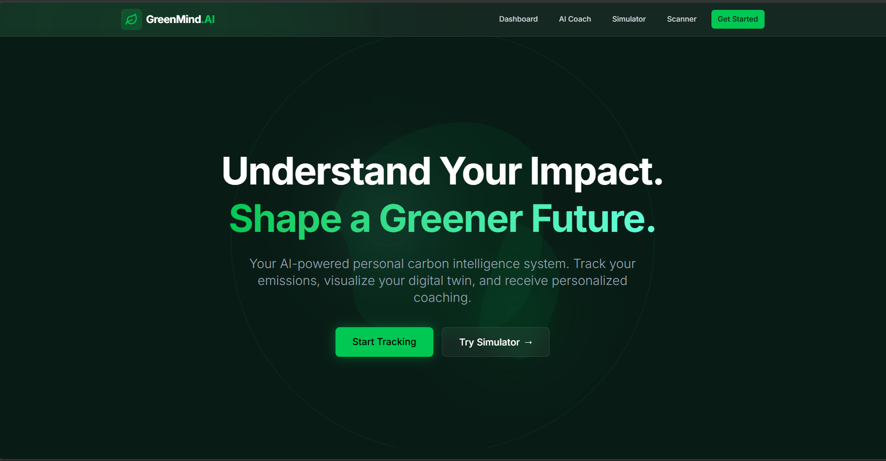
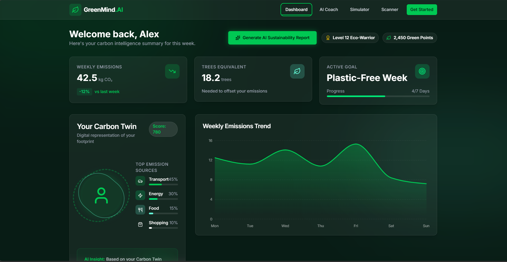
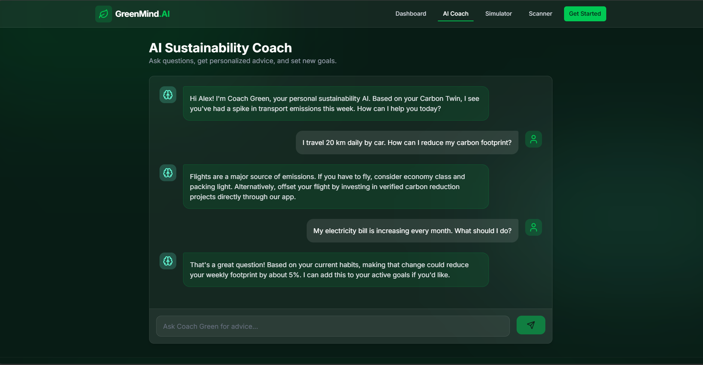
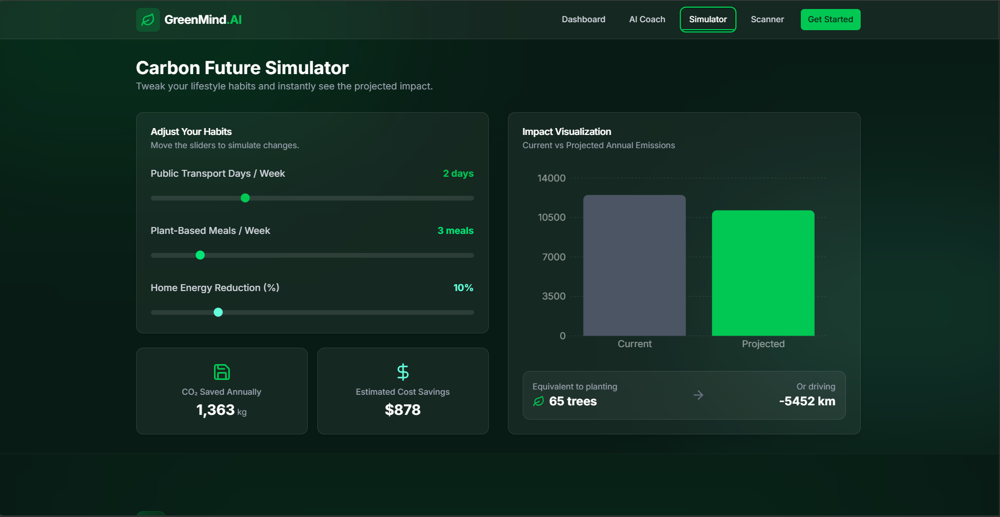
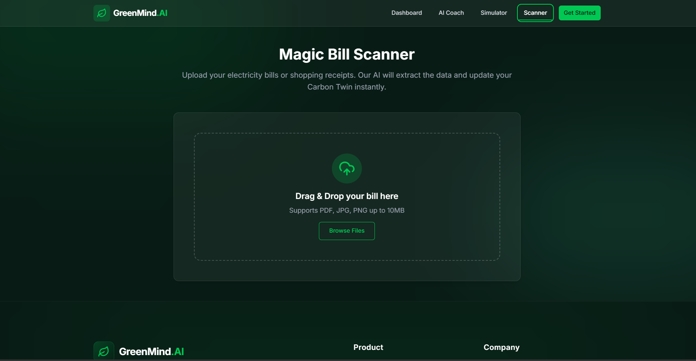
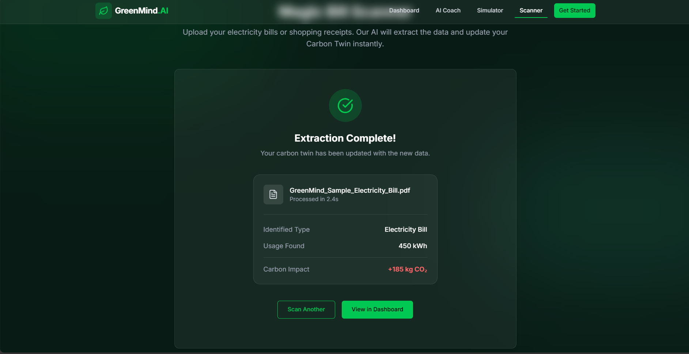

# 🌍 GreenMind AI

## AI-Powered Carbon Intelligence Platform

> Understand Your Impact. Shape a Greener Future.

GreenMind AI is an AI-powered sustainability platform designed to help individuals understand, track, predict, and reduce their carbon footprint through intelligent insights, environmental forecasting, and personalized sustainability recommendations.

---

## 🚀 Live Demo

https://greenmind-ai01.netlify.app/

---

## 📂 GitHub Repository

https://github.com/arjith2328/greenmind-ai

---

# 🎯 Challenge Alignment

GreenMind AI directly solves the **Carbon Footprint Awareness Platform** challenge by helping users:

✅ Track carbon emissions

✅ Monitor electricity consumption

✅ Analyze utility bills

✅ Forecast future emissions

✅ Understand environmental impact

✅ Receive AI-powered sustainability guidance

✅ Build sustainable habits

✅ Reduce their carbon footprint through actionable recommendations

---

# ✨ Core Features

## 🤖 AI Sustainability Coach

Provides intelligent sustainability recommendations based on user behavior and Carbon Twin analysis.

Example:

**User**

> I travel 20 km daily by car. How can I reduce my carbon footprint?

**GreenMind AI**

> Switching to public transport twice a week can reduce annual emissions by approximately 420 kg CO₂ while saving transportation costs.

---

## 🌎 Carbon Twin Technology

Creates a digital environmental profile that represents the user's sustainability habits and carbon impact.

Tracks:

- Transportation
- Energy
- Food
- Shopping
- Lifestyle Activities

---

## 📊 Sustainability Dashboard

Real-time sustainability analytics including:

- Weekly Emissions
- Carbon Score
- Emission Sources
- Sustainability Goals
- Trees Equivalent
- Green Points
- AI Sustainability Reports

---

## 🔮 Carbon Future Simulator

Simulate lifestyle changes and instantly view:

- Carbon Reduction
- Cost Savings
- Emission Forecasts
- Trees Equivalent
- Environmental Impact

---

## 🧾 Magic Bill Scanner

Upload electricity bills and automatically:

- Detect energy consumption
- Calculate carbon impact
- Update Carbon Twin
- Generate sustainability insights

---

## 📄 AI Sustainability Report Generator

Generate intelligent sustainability reports including:

- Carbon Score
- Emission Breakdown
- Sustainability Strengths
- Areas for Improvement
- AI Recommendations

---

## 🌱 Environmental Impact Visualization

Convert emissions into real-world metrics:

- Trees Required
- CO₂ Saved
- Energy Saved
- Distance Not Driven

---

## 🛣️ Carbon Reduction Roadmap

Receive personalized sustainability plans with projected annual carbon savings.

---

# 📸 Application Screenshots

## Landing Page



---

## Sustainability Dashboard



---

## AI Sustainability Coach



---

## Carbon Future Simulator



---

## Magic Bill Scanner



---

## Bill Analysis Result



---

# 🌍 Carbon Footprint Awareness Impact

GreenMind AI enables users to:

### Understand

Learn where emissions originate.

### Track

Monitor emissions across transportation, electricity, and lifestyle activities.

### Predict

Forecast future emissions using simulation tools.

### Reduce

Receive personalized AI recommendations.

### Act

Follow sustainability roadmaps and measurable environmental goals.

---

# 🏗️ Technology Stack

## Frontend

- React
- TypeScript
- Vite

## Styling

- Tailwind CSS
- Framer Motion
- Glassmorphism UI

## Data Visualization

- Recharts

## Deployment

- Netlify

---

# ♿ Accessibility

Implemented accessibility best practices:

- Semantic HTML
- Keyboard Navigation
- Responsive Design
- ARIA Labels
- Screen Reader Support

---

# 🔒 Security

Security features include:

- Input Validation
- File Type Validation
- File Size Restrictions
- Safe Error Handling
- Client-Side Processing
- Upload Security Checks

---

# 🧪 Testing

Application includes:

- Component Testing
- Navigation Testing
- Dashboard Validation
- Simulator Validation
- Scanner Validation
- Accessibility Validation

---

# ⚡ Performance

- Optimized React Components
- Code Splitting
- Lazy Loading
- Fast Vite Production Build
- Responsive Design

---

# 🚀 Installation

```bash
git clone https://github.com/arjith2328/greenmind-ai

cd greenmind-ai

npm install

npm run dev
```

## Production Build

```bash
npm run build
```

## Lint

```bash
npm run lint
```

---

# 🏆 Hackathon Submission

### Challenge

Carbon Footprint Awareness Platform

### Project

GreenMind AI – Personal Carbon Intelligence System

### Team

Arjith S.R

---

## 🌱 Small Actions Today. Sustainable Future Tomorrow.

Built with ❤️ for a greener future.
